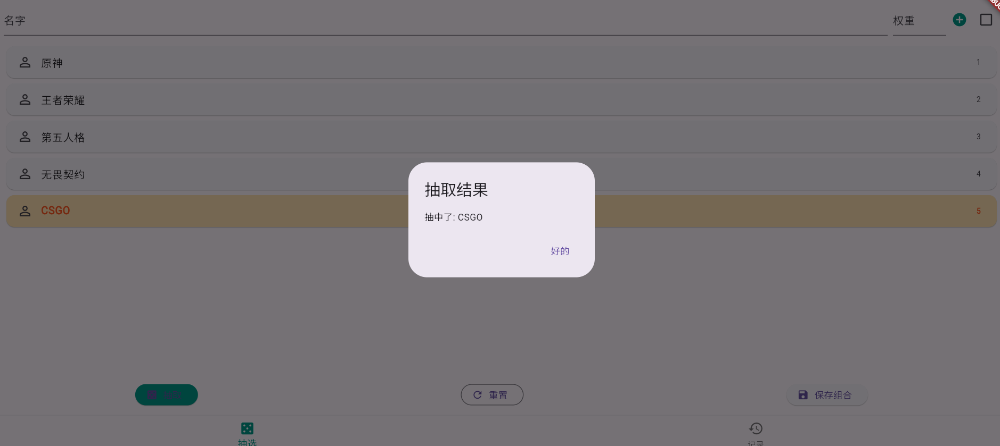
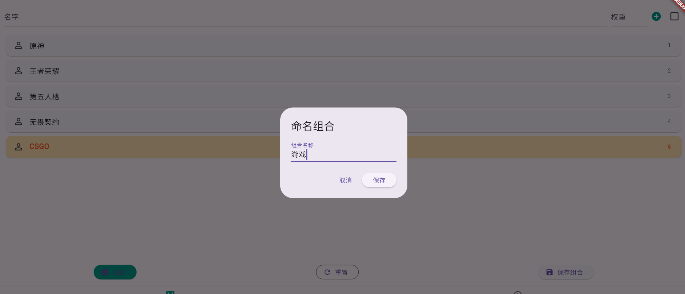

# choose

## Introduction

"choose" is a simple, cross-platform weighted random picker built with Flutter. It helps you draw lots, pick names, or group people with custom weights, and supports saving and reusing your favorite combinations.

## Features
- Custom entries with weights (higher weight = higher chance)
- One-click draw with animated highlight
- Save and manage your favorite combinations
- History records can be reused or batch deleted
- Clean UI, multi-platform support

## Quick Start

### Requirements
- Flutter SDK (>=2.19.0, compatible with 3.x)
- Dart SDK
- Supported OS: Windows, macOS, Linux, Android, iOS

### Install dependencies
```bash
flutter pub get
```

### Run the app
```bash
flutter run
```

### Build release
- Android: `flutter build apk`
- iOS: `flutter build ios`
- Windows: `flutter build windows`
- macOS: `flutter build macos`
- Linux: `flutter build linux`

## Dependencies
- shared_preferences: for local storage of history
- cupertino_icons: iOS style icons

---

## Screenshots

Main Page:



Draw Animation:



History:


