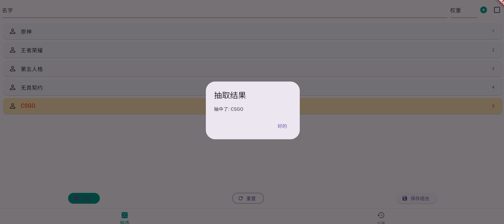
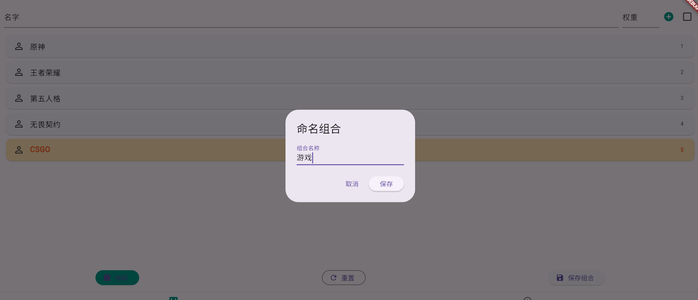

# 抽选器（choose）

## 简介

“抽选器”是一款基于Flutter开发的简单抽奖/随机选择工具。支持带权重的随机抽选，适用于分组、抽奖、点名等多种场景。你可以自定义候选项及其权重，保存常用组合，随时调用历史记录进行再次抽选。

## 主要功能
- 支持自定义候选项及权重，权重越高被抽中的概率越大
- 一键抽选，动画高亮展示结果
- 支持保存和管理常用抽选组合
- 历史记录可复用、批量删除
- 简洁美观的界面，支持多平台运行

## 快速运行

### 环境要求
- Flutter SDK（建议 2.19.0 及以上，兼容 3.x）
- Dart SDK
- 支持的操作系统：Windows、macOS、Linux、Android、iOS

### 安装依赖
```bash
flutter pub get
```

### 运行项目
```bash
flutter run
```

### 构建发布包
- Android: `flutter build apk`
- iOS: `flutter build ios`
- Windows: `flutter build windows`
- macOS: `flutter build macos`
- Linux: `flutter build linux`

## 依赖说明
- shared_preferences：用于本地存储历史抽选组合
- cupertino_icons：iOS风格图标支持

---

## 截图示例

主界面：



抽选动画：



历史记录：


